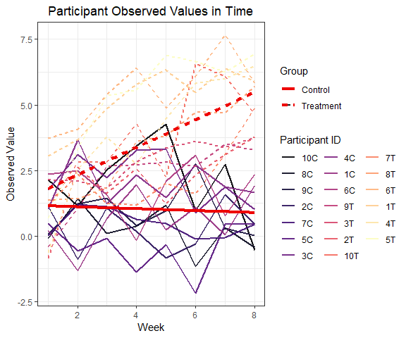

P8105 Homework 5
================
Quinton Neville
November 6, 2018

Problem 1
=========

``` r
data.csv.path <- list.files(path = "./data", pattern = "[ce][ox][np][_]+") 

read.p1.data <- function(data.csv.path){
  read_csv(paste0("./data/", data.csv.path)) %>%
  gather(key = week, value = observation) %>%
  mutate(
    week = week %>% substring(., 6) %>% as.numeric(),
    id = data.csv.path %>% rep(., length = length(week)) %>% parse_number(),
    group = data.csv.path %>% rep(., length = length(week)) %>% str_extract(., "[ce][ox][np]")
  ) %>%
  select(id, week, group, everything())
}

p1.df <- purrr::map_df(data.csv.path, read.p1.data) %>%
  mutate(group = group %>% as.factor() %>% forcats::fct_recode(., "Control" = "con", "Treatment" = "exp"),
         id = ifelse(group == "Control", paste0(id, "C"), paste0(id, "T")) %>% as.factor() %>% forcats::fct_reorder2(., week, observation, .desc = FALSE)
  )

#str(p1.df)

#Spaghetti Plot of Each particpant's observed value over time

p1.spaghetti <- p1.df %>%
  ggplot(aes(x = week, y = observation, colour = id)) +
  geom_line(aes(linetype = group), alpha = 0.7, size = 1) +
  geom_smooth(aes(linetype = group), alpha = 0.8, method = "lm", se = FALSE, colour = "black", size = 1.5) +
     labs(
    x = "Week",
    y = "Observed Value",
    title = "Participant Observed Values in Time"
   ) +
   viridis::scale_colour_viridis(
    option = "magma",
    name = "Participant ID", 
    discrete = TRUE,
    guide = guide_legend(ncol = 3)
   ) +
  theme(legend.position = "right") +
  scale_linetype_discrete(name = "Group") 

p1.spaghetti
```



Problem 2
=========

``` r
#Read in the wp homicide data
wp.homicide.df <- read_csv("./data/wp_homicide_data.csv")

#Snag Dimensions and summary
dim.wp.df <- dim(wp.homicide.df)

#Unique City/State locations
unique.locations <- wp.homicide.df %>% distinct(., city, state) %>% nrow() #Problem, Tulsa, AL not a city
                                                                           #Error, only one observation, lat/long matches OK

#New city_state variable and data nest
city.homicide.df <- wp.homicide.df %>%
  mutate(
    state = state %>% replace(., city == "Tulsa" & state == "AL", "OK"),  #Replace incorrect Tulsa obs. with OK
    city_state = str_c(city, state, sep = ", "), #Create new city_state var with string concatenate
    unsolved = ifelse(disposition == "Closed without arrest" | disposition == "Open/No arrest", 1, 0)
  ) %>% select(city_state, everything()) %>%
  group_by(city_state) %>%
  summarize(
    unsolved_homicides = sum(unsolved),
    total_homicides = n()
  ) %>% ungroup() 

#Baltimore, MD example
baltimore.example <- city.homicide.df %>%
   filter(city_state == "Baltimore, MD") %>%
   with(., prop.test(x = unsolved_homicides, n = total_homicides)) %>%
  broom::tidy() %>%
  select(estimate, conf.low, conf.high)

#Full tidyr pipeline, Iterate over city_states, prop.test, tidy, unnest, select proper vars
city.prop.df <- city.homicide.df %>%
   mutate(prop.output = map2(.x = unsolved_homicides, .y = total_homicides, ~prop.test(x = .x, n = .y)) %>%
                        map(., broom::tidy)) %>%
  unnest() %>%
  select(city_state, estimate, conf.low, conf.high)
```

``` r
#Bar plot of props with error bars
city.prop.bar <- city.prop.df %>%
  mutate(city_state = city_state %>% as.factor() %>% forcats::fct_reorder(., estimate, .desc = FALSE)) %>%
  ggplot(aes(x = city_state, y = estimate, fill = estimate)) +
  geom_bar(stat = "identity", colour = "black", width = 1, alpha = 0.9) +
  geom_errorbar(aes(x = city_state, ymin = conf.low, ymax = conf.high), size = .9, alpha = 0.9) +
  coord_flip() +
  viridis::scale_fill_viridis(
    option = "magma",
    name = "Proportion", 
    discrete = FALSE
  ) +
  labs(
    x = "City",
    y = "Proportion of Unsolved Homicides",
    title = "Proportion of Unsolved Homicides by City"
  ) +
    theme(legend.position = "bottom",
        axis.text.y = element_text(color = "black", 
        size = 10,  hjust = 1) ) 
  

city.prop.bar
```


