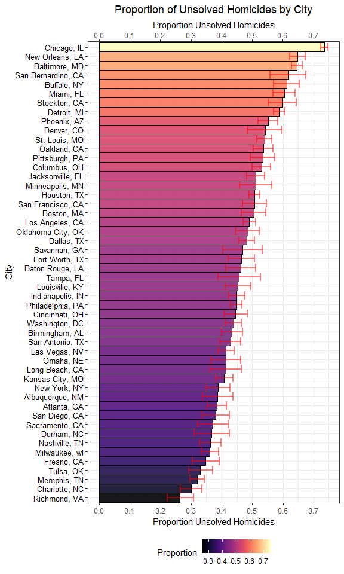

P8105 Homework 5
================
Quinton Neville
November 6, 2018

Problem 1
=========

These problems concerns a set of data files taken from a study with a control and treatment arm. Each data frame describes participant level observations over time, in each group. We will iteratively read in the data frame, clean and tidy the resulting data from all participants, and produce a spaghetti plot of each participant, highlighting overarching group trends, over the 8-week follow-up period.

``` r
#Import and tidy the data frames
p1.df <- list.files(path = "./data", pattern = "[ce][ox][np][_]+") %>% as.tibble() %>%   #Pull .csv file names, cast as tibble
  rename(data_csv_path = value) %>%                                                      #Give appropriate var names
  mutate(input_files = map(.x = data_csv_path, ~read_csv(paste0("./data/", .x)))) %>%    #Add list.col var data frames
  unnest() %>%                                                                           #Unnest, turn list.col df's into col. vars
  gather(key = week, value = observation, week_1:week_8) %>%                             #Gather by week, turn into long data
  mutate(
    week = week %>% parse_number(),                                                      #Extract numeric from week
    group = data_csv_path %>% str_extract(., "[ce][ox][np]") %>% as.factor() %>%         #Pull con, exp group from .csv name
      forcats::fct_recode(., "Control" = "con", "Treatment" = "exp"),                    #Cast as factor, relevel w/appropriate names
    id = data_csv_path %>% parse_number()                                                #Extract numeric participant id from .csv name
  ) %>%
  select(id, week, group, observation, -data_csv_path)                                   #Select only necessary tidy df vars

#Spaghetti Plot of Each particpant's observed value over time
p1.spaghetti <- p1.df %>%
  mutate(
    id = ifelse(group == "Control", paste0(id, "C"), paste0(id, "T")) %>% as.factor() %>% #Adding unique identifier for each id by group
      forcats::fct_reorder2(., week, observation, .desc = FALSE)                          #cast as factor, relevel by week, obs
  ) %>%
  ggplot(aes(x = week, y = observation, colour = id)) +
  geom_line(aes(linetype = group), alpha = 0.9, size = 1) +     
  geom_smooth(aes(linetype = group), alpha = 0.5, method = "lm", se = FALSE, colour = "red2", size = 1.5) +
     labs(
    x = "Week",
    y = "Observed Value",
    title = "Participant Observed Values in Time"
   ) +
   viridis::scale_colour_viridis(
    option = "magma",
    name = "Participant ID", 
    discrete = TRUE,
    guide = guide_legend(ncol = 3)
   ) +
  theme(legend.position = "right") +
  scale_linetype_discrete(name = "Group") 

p1.spaghetti
```


Concerning the spaghetti plot above, the overarching linear model fit lines by group (in red) elicit that the treatment group's observations exhibiting a significant mean increase in expected observation values over time, while the control goup's observed values began and maintained a lower average value, with a slight decrease in time. Additionally, both group's observed values began at a relatively low position (near zero), there do exist two participants with the highest observed values at week zero, and over time. Lastly, the linear fit trends imply that the treatment group experienced a marked increase in observed value over time, compared to the control, and the control group exhibited a static, lower, and less variable observed value trend in time, compared to the treatment group.

Problem 2
=========

These

``` r
#Read in the wp homicide data
wp.homicide.df <- read_csv("./data/wp_homicide_data.csv")

#Snag Dimensions and summary
dim.wp.df <- dim(wp.homicide.df)

#Unique City/State locations
unique.locations <- wp.homicide.df %>% distinct(., city, state) %>% nrow() #Problem, Tulsa, AL not a city
                                                                           #Error, only one observation, lat/long matches OK

#New city_state variable and data nest
city.homicide.df <- wp.homicide.df %>%
  mutate(
    state = state %>% replace(., city == "Tulsa" & state == "AL", "OK"),  #Replace incorrect Tulsa obs. with OK
    city_state = str_c(city, state, sep = ", "), #Create new city_state var with string concatenate
    unsolved = ifelse(disposition == "Closed without arrest" | disposition == "Open/No arrest", 1, 0)
  ) %>% select(city_state, everything()) %>%
  group_by(city_state) %>%
  summarize(
    unsolved_homicides = sum(unsolved),
    total_homicides = n()
  ) %>% ungroup() 

#Baltimore, MD example
baltimore.example <- city.homicide.df %>%
   filter(city_state == "Baltimore, MD") %>%
   with(., prop.test(x = unsolved_homicides, n = total_homicides)) %>%
  broom::tidy() %>%
  select(estimate, conf.low, conf.high)

#Full tidyr pipeline, Iterate over city_states, prop.test, tidy, unnest, select proper vars
city.prop.df <- city.homicide.df %>%
   mutate(prop.output = map2(.x = unsolved_homicides, .y = total_homicides, ~prop.test(x = .x, n = .y)) %>%
                        map(., broom::tidy)) %>%
  unnest() %>%
  select(city_state, estimate, conf.low, conf.high)
```

``` r
#Bar plot of props with error bars
city.prop.bar <- city.prop.df %>%
  mutate(city_state = city_state %>% as.factor() %>% forcats::fct_reorder(., estimate, .desc = FALSE)) %>%
  ggplot(aes(x = city_state, y = estimate, fill = estimate)) +
  geom_bar(stat = "identity", colour = "black", width = 1, alpha = 0.9) +
  geom_errorbar(aes(x = city_state, ymin = conf.low, ymax = conf.high), colour = "red", size = .9, alpha = 0.5) +
  coord_flip() +
  viridis::scale_fill_viridis(
    option = "magma",
    name = "Proportion", 
    discrete = FALSE
  ) +
  labs(
    x = "City",
    y = "Proportion Unsolved Homicides",
    title = "Proportion of Unsolved Homicides by City"
  ) +
    theme(legend.position = "bottom",
        axis.text.y = element_text(color = "black", 
        size = 10,  hjust = 1) ) +
  scale_y_continuous(breaks = seq(0, 0.8, 0.1), sec.axis = dup_axis())
  
city.prop.bar
```


